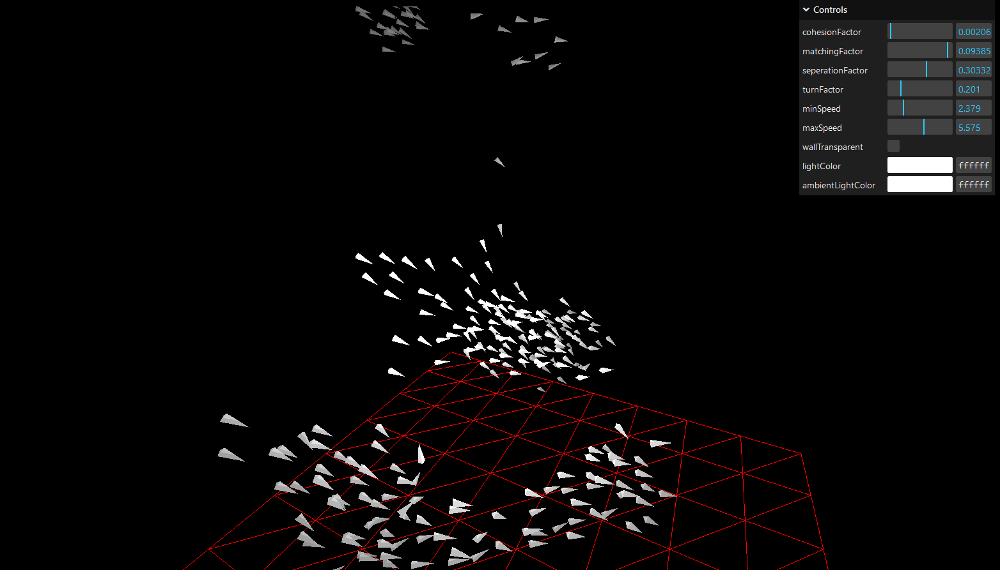
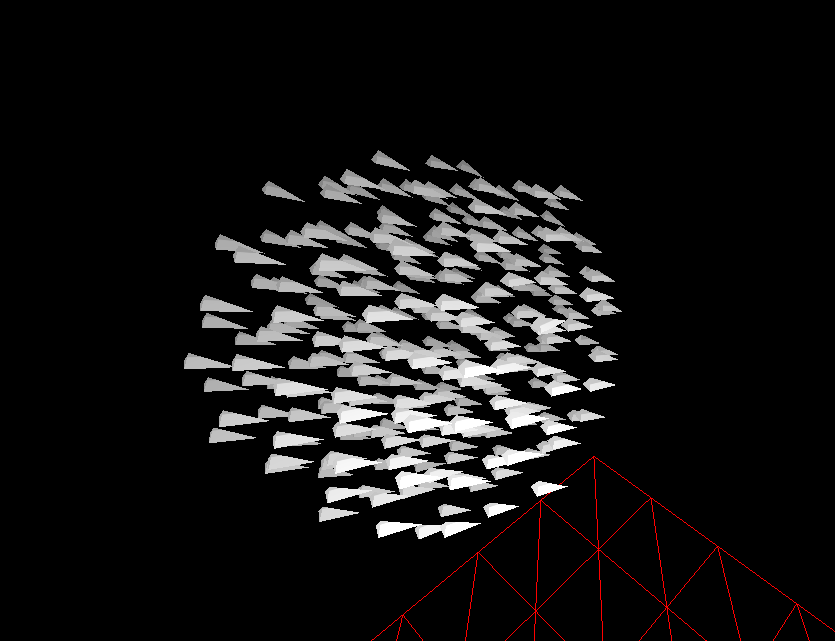
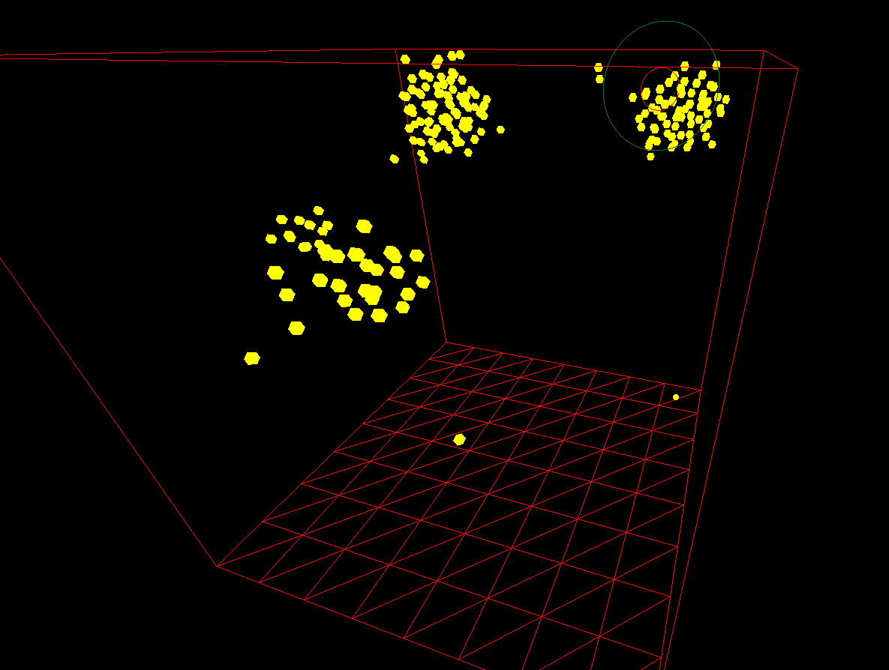

# 3D Boids Simulation with JavaScript, Three.js, and WebGL

## Description
This project extends the classic Boids algorithm into a 3D environment using JavaScript, Three.js, and the power of WebGL rendering. It simulates the collective motion of autonomous agents (boids) in a three-dimensional space, mimicking the flocking behavior observed in nature.

### Future Goals
- I aim to optimize this algorithim so that it runs on the gpu, using glsl
- I aim to use rays to allow the boids to "see" their environement
- i would like to add predetor/prey interactions

### Features
- Real-time simulation of flocking behavior in a 3D space.
- Smooth and immersive rendering powered by Three.js and WebGL.

### Current Behavior
The boids are currently tweaked to mimic fish and other schooling animals.

## Instructions
1. Clone or download the repository to your local machine.
2. Run `npm install` to install dependencies.
3. In the command line, run `npm run dev` to start the development server.
4. Interact with the simulation using the provided controls:
    - Adjust cohesion strength, alignment (matching) strength, separation distance, turn factor, min and max speed, visual range, and protected range to customize the behavior of the flock.
    

## Controls
- **Cohesion Strength:** Adjust how strongly boids are attracted to the center of the flock.
- **Alignment Strength:** Control how much boids try to match the velocity of nearby flockmates.
- **Separation Distance:** Set the distance at which boids maintain separation from each other.
- **Turn Factor:** Determine how aggressively boids try to stay within view.
- **Min Speed:** Set the minimum speed of boids.
- **Max Speed:** Set the maximum speed of boids.
- **Visual Range:** Adjust the range in which boids detect and react to nearby flockmates.
- **Protected Range:** Define the area in which boids are protected from external disturbances.
- **Camera Views:** Toggle between different camera views to observe the flock's behavior from various perspectives.

## Resources
- [Cornell University Lab](https://people.ece.cornell.edu/land/courses/ece4760/labs/s2021/Boids/Boids.html)
- [Original Paper by C.W.Reynolds](https://www.cs.toronto.edu/~dt/siggraph97-course/cwr87/)

## Progression
### First Stages of converting to 3D

<!--  -->
### Working model with textures

### Better fish simulation

