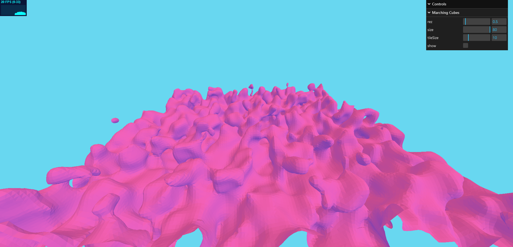

# Marching Cubes Algorithm with Three.js

This is an implementation of the marching cubes algorithm using JavaScript and Three.js, aiming to create 3D surfaces from volumetric data. 
Currently it uses the cpu to create the geometry, and while its fast, it will always be faster on the gpu as a shader. This is currently outside of my skill range, but will hopefully be implemented at some stage

## Overview

The marching cubes algorithm converts 3D scalar data into detailed surfaces, making it ideal for visualizing complex data like medical scans or terrain models.

## Features

- **Real-time Rendering**: Utilizes Three.js for interactive 3D visualization.
- **Parameter Customization**: Adjust thresholds and grid resolutions for different datasets.
- **Easy Setup**: Run directly in a web browser with WebGL support.
- **Tiled Geometry**: CPU optimised using chunks/tiles instead of loading everything at once

