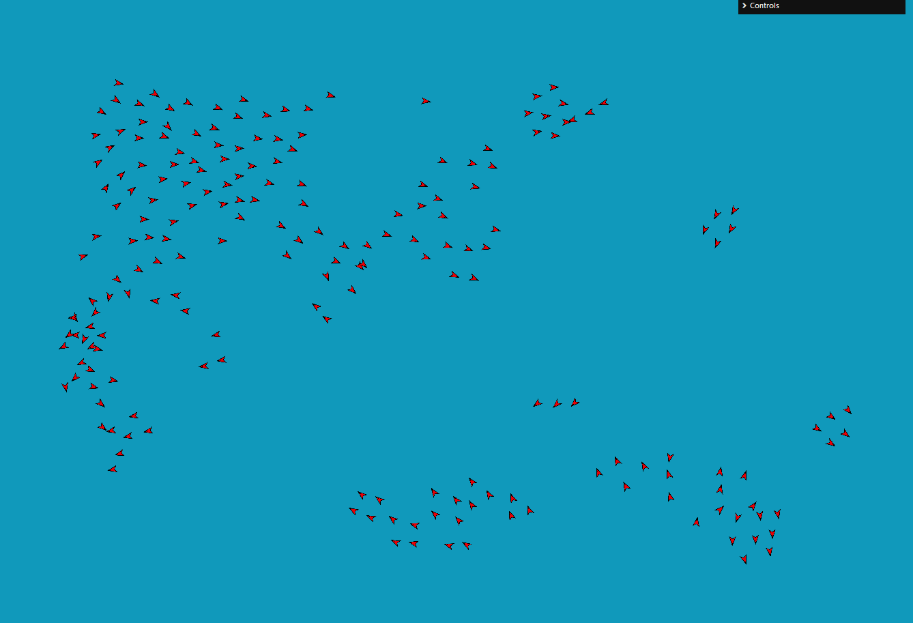
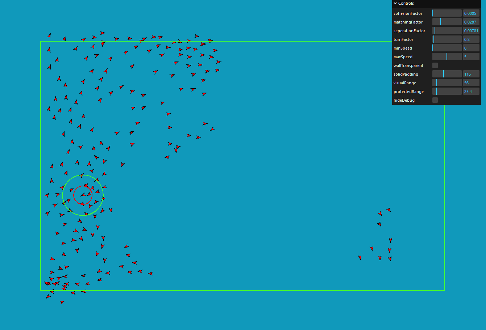

# 2D Boids Simulation with JavaScript and Pixi.js

## Description
This project is an implementation of the classic Boids algorithm in a 2D environment using JavaScript and the Pixi.js 2D rendering library. It attempts to mimic the flocking behavior observed in nature, from the flight patterns of birds to the synchronized movement of fish.

## Features
- Real-time simulation of flocking behavior with adjustable parameters.
- Smooth rendering powered by Pixi.js.

### Boids With and without debug view

## Instructions
1. Clone or download the repository to your local machine.
2. In the command line run "npm run dev"
3. Interact with the simulation using the provided controls:
    - Adjust cohesion strength, alignment (matching) strength, separation distance, turn factor, min and max speed, visual range, and protected range to customize the behavior of the flock.
    - Toggle between transparent or solid borders for the simulation area.

## Controls
- **Cohesion Strength:** Adjust how strongly boids are attracted to the center of the flock.
- **Alignment Strength:** Control how much boids try to match the velocity of nearby flockmates.
- **Separation Distance:** Set the distance at which boids maintain separation from each other.
- **Turn Factor:** Determine how aggressively boids try to stay on screen.
- **Min Speed:** Set the minimum speed of boids.
- **Max Speed:** Set the maximum speed of boids.
- **Visual Range:** Adjust the range in which boids detect and react to nearby flockmates.
- **Protected Range:** Define the area in which boids are protected from external disturbances.
- **Border Type:** Toggle between transparent or solid borders for the simulation area.

## Resources
- [Cornell University Lab](https://people.ece.cornell.edu/land/courses/ece4760/labs/s2021/Boids/Boids.html)
- [Original Paper by C.W.Reynolds](https://www.cs.toronto.edu/~dt/siggraph97-course/cwr87/)